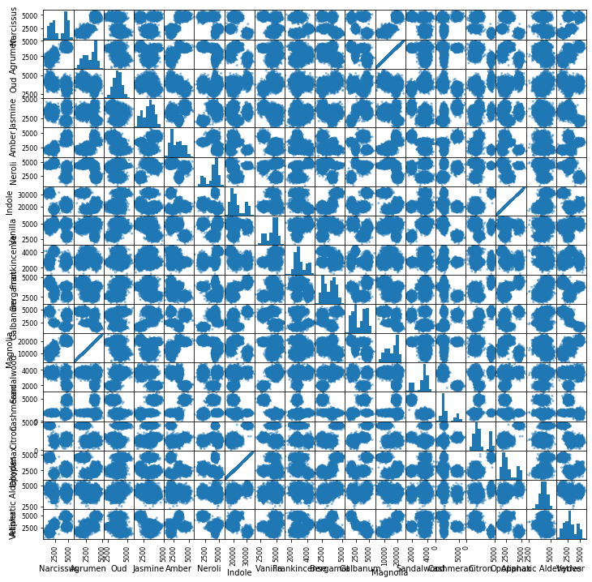
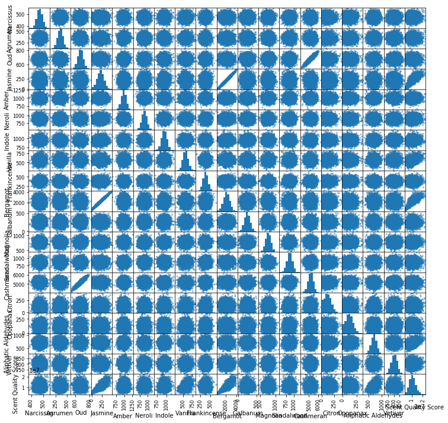
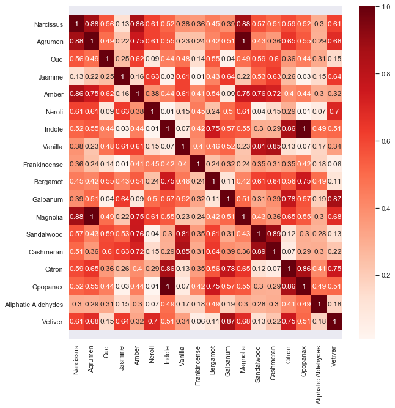
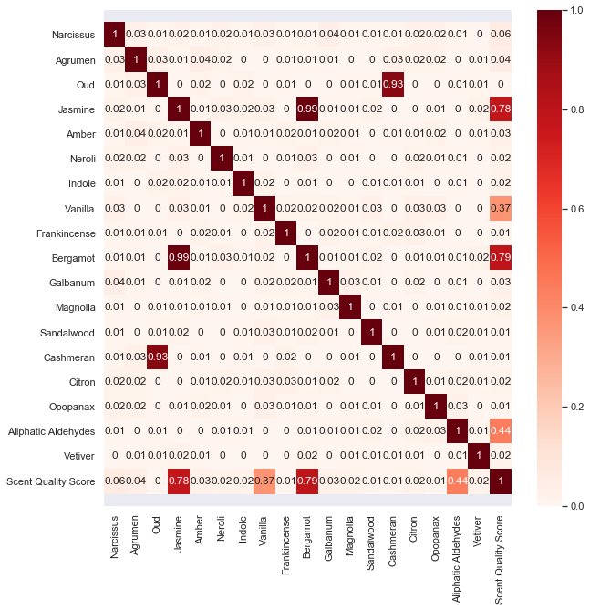
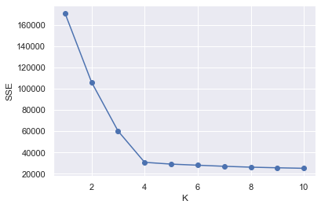
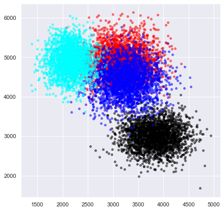
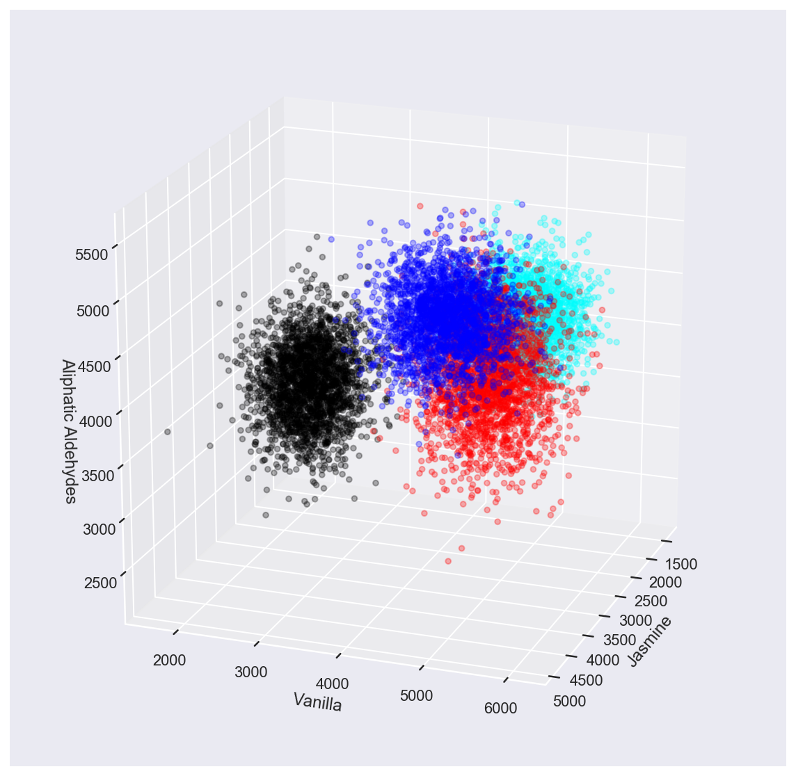
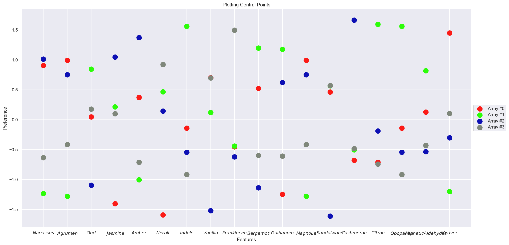

# 1. Load the data-set


```python
import numpy as np
import pandas as pd
import matplotlib.pyplot as plt
import seaborn as sns
from sklearn import preprocessing 
from sklearn.cluster import KMeans 
import matplotlib.pyplot as plt
```

We need to lead the perfume dataset from sklearn


```python
perfume_preference = pd.read_csv("Perfume preference.csv")
perfume_preference
```


<div>
<style scoped>
    .dataframe tbody tr th:only-of-type {
        vertical-align: middle;
    }

    .dataframe tbody tr th {
        vertical-align: top;
    }

    .dataframe thead th {
        text-align: right;
    }
</style>
<table border="1" class="dataframe">
  <thead>
    <tr style="text-align: right;">
      <th></th>
      <th>Narcissus</th>
      <th>Agrumen</th>
      <th>Oud</th>
      <th>Jasmine</th>
      <th>Amber</th>
      <th>Neroli</th>
      <th>Indole</th>
      <th>Vanilla</th>
      <th>Frankincense</th>
      <th>Bergamot</th>
      <th>Galbanum</th>
      <th>Magnolia</th>
      <th>Sandalwood</th>
      <th>Cashmeran</th>
      <th>Citron</th>
      <th>Opopanax</th>
      <th>Aliphatic Aldehydes</th>
      <th>Vetiver</th>
    </tr>
  </thead>
  <tbody>
    <tr>
      <th>0</th>
      <td>1353.0</td>
      <td>1252.0</td>
      <td>4066.0</td>
      <td>3838.0</td>
      <td>2144.0</td>
      <td>4404.0</td>
      <td>32082.0</td>
      <td>3866.0</td>
      <td>2505.0</td>
      <td>3972.0</td>
      <td>4485.0</td>
      <td>6441.0</td>
      <td>4106.0</td>
      <td>1722.0</td>
      <td>4287.0</td>
      <td>4820.0</td>
      <td>4140.0</td>
      <td>1463.0</td>
    </tr>
    <tr>
      <th>1</th>
      <td>1089.0</td>
      <td>2152.0</td>
      <td>4045.0</td>
      <td>3710.0</td>
      <td>2235.0</td>
      <td>4352.0</td>
      <td>30398.0</td>
      <td>4769.0</td>
      <td>2995.0</td>
      <td>4720.0</td>
      <td>4532.0</td>
      <td>10931.0</td>
      <td>3794.0</td>
      <td>1638.0</td>
      <td>4648.0</td>
      <td>4472.0</td>
      <td>4184.0</td>
      <td>1071.0</td>
    </tr>
    <tr>
      <th>2</th>
      <td>4177.0</td>
      <td>3592.0</td>
      <td>3596.0</td>
      <td>1745.0</td>
      <td>3234.0</td>
      <td>2116.0</td>
      <td>21678.0</td>
      <td>4864.0</td>
      <td>3178.0</td>
      <td>3381.0</td>
      <td>1376.0</td>
      <td>18153.0</td>
      <td>2502.0</td>
      <td>1733.0</td>
      <td>1747.0</td>
      <td>2728.0</td>
      <td>4580.0</td>
      <td>4742.0</td>
    </tr>
    <tr>
      <th>3</th>
      <td>4899.0</td>
      <td>3738.0</td>
      <td>2454.0</td>
      <td>3976.0</td>
      <td>4945.0</td>
      <td>3853.0</td>
      <td>17963.0</td>
      <td>3040.0</td>
      <td>2943.0</td>
      <td>2870.0</td>
      <td>4016.0</td>
      <td>18819.0</td>
      <td>1990.0</td>
      <td>5118.0</td>
      <td>2391.0</td>
      <td>2012.0</td>
      <td>3470.0</td>
      <td>3057.0</td>
    </tr>
    <tr>
      <th>4</th>
      <td>4822.0</td>
      <td>4030.0</td>
      <td>3447.0</td>
      <td>4225.0</td>
      <td>4078.0</td>
      <td>3772.0</td>
      <td>23988.0</td>
      <td>3389.0</td>
      <td>2415.0</td>
      <td>2695.0</td>
      <td>3887.0</td>
      <td>20367.0</td>
      <td>2118.0</td>
      <td>4530.0</td>
      <td>2427.0</td>
      <td>3205.0</td>
      <td>4319.0</td>
      <td>2289.0</td>
    </tr>
    <tr>
      <th>...</th>
      <td>...</td>
      <td>...</td>
      <td>...</td>
      <td>...</td>
      <td>...</td>
      <td>...</td>
      <td>...</td>
      <td>...</td>
      <td>...</td>
      <td>...</td>
      <td>...</td>
      <td>...</td>
      <td>...</td>
      <td>...</td>
      <td>...</td>
      <td>...</td>
      <td>...</td>
      <td>...</td>
    </tr>
    <tr>
      <th>9492</th>
      <td>4857.0</td>
      <td>3654.0</td>
      <td>2788.0</td>
      <td>3830.0</td>
      <td>4272.0</td>
      <td>4349.0</td>
      <td>20816.0</td>
      <td>2524.0</td>
      <td>2675.0</td>
      <td>2550.0</td>
      <td>4620.0</td>
      <td>18506.0</td>
      <td>1999.0</td>
      <td>5329.0</td>
      <td>2140.0</td>
      <td>2568.0</td>
      <td>4358.0</td>
      <td>2361.0</td>
    </tr>
    <tr>
      <th>9493</th>
      <td>2040.0</td>
      <td>2561.0</td>
      <td>3913.0</td>
      <td>3375.0</td>
      <td>2058.0</td>
      <td>4722.0</td>
      <td>19399.0</td>
      <td>4765.0</td>
      <td>3796.0</td>
      <td>2949.0</td>
      <td>2686.0</td>
      <td>13008.0</td>
      <td>4201.0</td>
      <td>1830.0</td>
      <td>1534.0</td>
      <td>2272.0</td>
      <td>3348.0</td>
      <td>2992.0</td>
    </tr>
    <tr>
      <th>9494</th>
      <td>4846.0</td>
      <td>4883.0</td>
      <td>4153.0</td>
      <td>2108.0</td>
      <td>4164.0</td>
      <td>1881.0</td>
      <td>20551.0</td>
      <td>5030.0</td>
      <td>2683.0</td>
      <td>4001.0</td>
      <td>1450.0</td>
      <td>24684.0</td>
      <td>3979.0</td>
      <td>1187.0</td>
      <td>2107.0</td>
      <td>2508.0</td>
      <td>4581.0</td>
      <td>4731.0</td>
    </tr>
    <tr>
      <th>9495</th>
      <td>4310.0</td>
      <td>3916.0</td>
      <td>3937.0</td>
      <td>2488.0</td>
      <td>3343.0</td>
      <td>2219.0</td>
      <td>22914.0</td>
      <td>5104.0</td>
      <td>2640.0</td>
      <td>3864.0</td>
      <td>1730.0</td>
      <td>19874.0</td>
      <td>3654.0</td>
      <td>499.0</td>
      <td>1920.0</td>
      <td>2971.0</td>
      <td>4476.0</td>
      <td>4654.0</td>
    </tr>
    <tr>
      <th>9496</th>
      <td>2698.0</td>
      <td>3174.0</td>
      <td>3984.0</td>
      <td>3541.0</td>
      <td>2522.0</td>
      <td>4946.0</td>
      <td>18512.0</td>
      <td>5165.0</td>
      <td>4167.0</td>
      <td>2704.0</td>
      <td>2536.0</td>
      <td>16069.0</td>
      <td>3851.0</td>
      <td>1620.0</td>
      <td>1830.0</td>
      <td>2084.0</td>
      <td>3240.0</td>
      <td>3644.0</td>
    </tr>
  </tbody>
</table>
<p>9497 rows × 18 columns</p>
</div>


```python
perfume_score = pd.read_csv("Perfume Score.csv")
perfume_score
```


<div>
<style scoped>
    .dataframe tbody tr th:only-of-type {
        vertical-align: middle;
    }

    .dataframe tbody tr th {
        vertical-align: top;
    }

    .dataframe thead th {
        text-align: right;
    }
</style>
<table border="1" class="dataframe">
  <thead>
    <tr style="text-align: right;">
      <th></th>
      <th>Narcissus</th>
      <th>Agrumen</th>
      <th>Oud</th>
      <th>Jasmine</th>
      <th>Amber</th>
      <th>Neroli</th>
      <th>Indole</th>
      <th>Vanilla</th>
      <th>Frankincense</th>
      <th>Bergamot</th>
      <th>Galbanum</th>
      <th>Magnolia</th>
      <th>Sandalwood</th>
      <th>Cashmeran</th>
      <th>Citron</th>
      <th>Opopanax</th>
      <th>Aliphatic Aldehydes</th>
      <th>Vetiver</th>
      <th>Scent Quality Score</th>
    </tr>
  </thead>
  <tbody>
    <tr>
      <th>0</th>
      <td>489.766</td>
      <td>343.510</td>
      <td>638.519</td>
      <td>315.377</td>
      <td>966.417</td>
      <td>913.256</td>
      <td>1015.036</td>
      <td>479.027</td>
      <td>485.797</td>
      <td>2918.050062</td>
      <td>108.538</td>
      <td>727.438</td>
      <td>936.842</td>
      <td>4801.306119</td>
      <td>261.952</td>
      <td>148.593</td>
      <td>783.264</td>
      <td>809.541</td>
      <td>1.302700e+07</td>
    </tr>
    <tr>
      <th>1</th>
      <td>472.841</td>
      <td>218.288</td>
      <td>642.332</td>
      <td>210.582</td>
      <td>995.068</td>
      <td>989.447</td>
      <td>958.614</td>
      <td>507.113</td>
      <td>242.015</td>
      <td>2119.074840</td>
      <td>246.654</td>
      <td>755.477</td>
      <td>840.936</td>
      <td>4896.315590</td>
      <td>149.498</td>
      <td>44.490</td>
      <td>906.204</td>
      <td>815.512</td>
      <td>1.159073e+07</td>
    </tr>
    <tr>
      <th>2</th>
      <td>472.620</td>
      <td>323.480</td>
      <td>696.770</td>
      <td>288.379</td>
      <td>1006.334</td>
      <td>875.163</td>
      <td>987.398</td>
      <td>611.463</td>
      <td>410.451</td>
      <td>2679.139347</td>
      <td>281.022</td>
      <td>729.155</td>
      <td>825.386</td>
      <td>5350.521973</td>
      <td>177.980</td>
      <td>141.612</td>
      <td>705.294</td>
      <td>794.394</td>
      <td>1.367693e+07</td>
    </tr>
    <tr>
      <th>3</th>
      <td>503.155</td>
      <td>397.632</td>
      <td>644.533</td>
      <td>151.414</td>
      <td>960.097</td>
      <td>905.462</td>
      <td>1031.227</td>
      <td>469.357</td>
      <td>388.405</td>
      <td>1784.035393</td>
      <td>280.953</td>
      <td>711.906</td>
      <td>786.198</td>
      <td>5029.939322</td>
      <td>29.515</td>
      <td>149.231</td>
      <td>678.681</td>
      <td>837.614</td>
      <td>7.997427e+06</td>
    </tr>
    <tr>
      <th>4</th>
      <td>499.780</td>
      <td>344.096</td>
      <td>643.764</td>
      <td>353.518</td>
      <td>1033.988</td>
      <td>978.976</td>
      <td>871.312</td>
      <td>439.266</td>
      <td>311.002</td>
      <td>3236.214279</td>
      <td>272.058</td>
      <td>737.003</td>
      <td>898.238</td>
      <td>4988.788504</td>
      <td>138.884</td>
      <td>122.238</td>
      <td>622.090</td>
      <td>824.174</td>
      <td>1.113290e+07</td>
    </tr>
    <tr>
      <th>...</th>
      <td>...</td>
      <td>...</td>
      <td>...</td>
      <td>...</td>
      <td>...</td>
      <td>...</td>
      <td>...</td>
      <td>...</td>
      <td>...</td>
      <td>...</td>
      <td>...</td>
      <td>...</td>
      <td>...</td>
      <td>...</td>
      <td>...</td>
      <td>...</td>
      <td>...</td>
      <td>...</td>
      <td>...</td>
    </tr>
    <tr>
      <th>4999</th>
      <td>449.162</td>
      <td>353.896</td>
      <td>680.031</td>
      <td>220.188</td>
      <td>940.716</td>
      <td>851.543</td>
      <td>951.874</td>
      <td>600.726</td>
      <td>383.718</td>
      <td>2209.955448</td>
      <td>122.345</td>
      <td>852.887</td>
      <td>973.806</td>
      <td>5122.835105</td>
      <td>50.474</td>
      <td>87.481</td>
      <td>662.834</td>
      <td>821.282</td>
      <td>1.072665e+07</td>
    </tr>
    <tr>
      <th>5000</th>
      <td>526.781</td>
      <td>392.868</td>
      <td>652.819</td>
      <td>268.901</td>
      <td>983.403</td>
      <td>700.787</td>
      <td>1031.042</td>
      <td>583.384</td>
      <td>414.174</td>
      <td>2453.815268</td>
      <td>368.325</td>
      <td>770.897</td>
      <td>825.038</td>
      <td>5009.288848</td>
      <td>195.544</td>
      <td>83.047</td>
      <td>819.217</td>
      <td>830.439</td>
      <td>1.426609e+07</td>
    </tr>
    <tr>
      <th>5001</th>
      <td>475.160</td>
      <td>256.740</td>
      <td>655.360</td>
      <td>204.422</td>
      <td>905.181</td>
      <td>1055.073</td>
      <td>1008.550</td>
      <td>539.192</td>
      <td>399.411</td>
      <td>2007.515839</td>
      <td>192.985</td>
      <td>774.179</td>
      <td>747.784</td>
      <td>4925.275302</td>
      <td>205.319</td>
      <td>143.601</td>
      <td>741.248</td>
      <td>780.727</td>
      <td>9.882660e+06</td>
    </tr>
    <tr>
      <th>5002</th>
      <td>481.422</td>
      <td>278.652</td>
      <td>647.467</td>
      <td>147.307</td>
      <td>1033.814</td>
      <td>880.379</td>
      <td>1053.847</td>
      <td>510.981</td>
      <td>410.661</td>
      <td>1762.999938</td>
      <td>144.866</td>
      <td>802.051</td>
      <td>890.813</td>
      <td>4992.597380</td>
      <td>116.158</td>
      <td>80.665</td>
      <td>804.591</td>
      <td>792.583</td>
      <td>9.200338e+06</td>
    </tr>
    <tr>
      <th>5003</th>
      <td>476.130</td>
      <td>364.371</td>
      <td>659.429</td>
      <td>224.550</td>
      <td>1207.776</td>
      <td>837.054</td>
      <td>882.858</td>
      <td>625.714</td>
      <td>361.077</td>
      <td>2175.815594</td>
      <td>231.943</td>
      <td>621.123</td>
      <td>737.455</td>
      <td>4939.983539</td>
      <td>231.950</td>
      <td>178.103</td>
      <td>710.752</td>
      <td>867.652</td>
      <td>1.195802e+07</td>
    </tr>
  </tbody>
</table>
<p>5004 rows × 19 columns</p>
</div>


# 2. Review the data quatitatively


```python
perfume_score.describe()
```


<div>
<style scoped>
    .dataframe tbody tr th:only-of-type {
        vertical-align: middle;
    }

    .dataframe tbody tr th {
        vertical-align: top;
    }

    .dataframe thead th {
        text-align: right;
    }
</style>
<table border="1" class="dataframe">
  <thead>
    <tr style="text-align: right;">
      <th></th>
      <th>Narcissus</th>
      <th>Agrumen</th>
      <th>Oud</th>
      <th>Jasmine</th>
      <th>Amber</th>
      <th>Neroli</th>
      <th>Indole</th>
      <th>Vanilla</th>
      <th>Frankincense</th>
      <th>Bergamot</th>
      <th>Galbanum</th>
      <th>Magnolia</th>
      <th>Sandalwood</th>
      <th>Cashmeran</th>
      <th>Citron</th>
      <th>Opopanax</th>
      <th>Aliphatic Aldehydes</th>
      <th>Vetiver</th>
      <th>Scent Quality Score</th>
    </tr>
  </thead>
  <tbody>
    <tr>
      <th>count</th>
      <td>5004.000000</td>
      <td>5004.000000</td>
      <td>5004.000000</td>
      <td>5004.000000</td>
      <td>5004.000000</td>
      <td>5004.000000</td>
      <td>5004.000000</td>
      <td>5004.000000</td>
      <td>5004.000000</td>
      <td>5004.000000</td>
      <td>5004.000000</td>
      <td>5004.000000</td>
      <td>5004.000000</td>
      <td>5004.000000</td>
      <td>5004.000000</td>
      <td>5004.000000</td>
      <td>5004.000000</td>
      <td>5004.000000</td>
      <td>5.004000e+03</td>
    </tr>
    <tr>
      <th>mean</th>
      <td>470.922058</td>
      <td>346.112136</td>
      <td>674.849797</td>
      <td>209.349424</td>
      <td>988.363780</td>
      <td>888.163961</td>
      <td>944.930020</td>
      <td>564.445091</td>
      <td>378.302281</td>
      <td>2186.942959</td>
      <td>250.475366</td>
      <td>769.066442</td>
      <td>866.283868</td>
      <td>5172.149509</td>
      <td>121.493370</td>
      <td>118.018880</td>
      <td>703.506534</td>
      <td>802.327559</td>
      <td>1.079593e+07</td>
    </tr>
    <tr>
      <th>std</th>
      <td>23.038942</td>
      <td>59.788428</td>
      <td>36.724524</td>
      <td>80.932744</td>
      <td>74.334501</td>
      <td>84.265546</td>
      <td>70.080494</td>
      <td>72.778522</td>
      <td>60.988463</td>
      <td>575.210895</td>
      <td>76.697327</td>
      <td>89.079681</td>
      <td>87.392412</td>
      <td>275.760510</td>
      <td>70.881267</td>
      <td>62.237022</td>
      <td>99.694353</td>
      <td>25.963051</td>
      <td>2.867554e+06</td>
    </tr>
    <tr>
      <th>min</th>
      <td>383.651000</td>
      <td>121.396000</td>
      <td>543.403000</td>
      <td>0.000000</td>
      <td>652.234000</td>
      <td>539.166000</td>
      <td>683.213000</td>
      <td>287.286000</td>
      <td>142.905000</td>
      <td>487.811886</td>
      <td>0.000000</td>
      <td>457.725000</td>
      <td>545.930000</td>
      <td>4119.640577</td>
      <td>0.000000</td>
      <td>0.000000</td>
      <td>317.364000</td>
      <td>714.678000</td>
      <td>3.860472e+06</td>
    </tr>
    <tr>
      <th>25%</th>
      <td>455.292000</td>
      <td>305.453750</td>
      <td>650.423250</td>
      <td>154.964250</td>
      <td>938.166000</td>
      <td>830.146500</td>
      <td>896.683000</td>
      <td>514.985750</td>
      <td>337.244250</td>
      <td>1804.401369</td>
      <td>198.506500</td>
      <td>707.927750</td>
      <td>809.248500</td>
      <td>4990.344908</td>
      <td>69.145750</td>
      <td>74.265250</td>
      <td>635.601500</td>
      <td>784.980750</td>
      <td>8.777066e+06</td>
    </tr>
    <tr>
      <th>50%</th>
      <td>470.695500</td>
      <td>346.160500</td>
      <td>675.707000</td>
      <td>209.278000</td>
      <td>989.786500</td>
      <td>889.092500</td>
      <td>945.116500</td>
      <td>563.099000</td>
      <td>378.364000</td>
      <td>2191.656699</td>
      <td>249.945000</td>
      <td>770.214000</td>
      <td>867.822500</td>
      <td>5174.842876</td>
      <td>118.840500</td>
      <td>117.010500</td>
      <td>703.989000</td>
      <td>802.968000</td>
      <td>1.057777e+07</td>
    </tr>
    <tr>
      <th>75%</th>
      <td>486.797750</td>
      <td>386.261000</td>
      <td>699.350250</td>
      <td>262.900250</td>
      <td>1038.281500</td>
      <td>945.673750</td>
      <td>993.838500</td>
      <td>612.617000</td>
      <td>418.213250</td>
      <td>2571.954572</td>
      <td>301.876250</td>
      <td>830.076000</td>
      <td>924.809000</td>
      <td>5358.193002</td>
      <td>170.583000</td>
      <td>160.389500</td>
      <td>769.465500</td>
      <td>819.953500</td>
      <td>1.255241e+07</td>
    </tr>
    <tr>
      <th>max</th>
      <td>548.708000</td>
      <td>562.238000</td>
      <td>817.061000</td>
      <td>481.593000</td>
      <td>1258.446000</td>
      <td>1183.733000</td>
      <td>1214.694000</td>
      <td>825.775000</td>
      <td>646.347000</td>
      <td>4079.337285</td>
      <td>535.614000</td>
      <td>1116.747000</td>
      <td>1195.179000</td>
      <td>6231.998892</td>
      <td>396.534000</td>
      <td>348.029000</td>
      <td>1049.738000</td>
      <td>888.987000</td>
      <td>2.203800e+07</td>
    </tr>
  </tbody>
</table>
</div>


```python
perfume_preference.describe()
```


<div>
<style scoped>
    .dataframe tbody tr th:only-of-type {
        vertical-align: middle;
    }

    .dataframe tbody tr th {
        vertical-align: top;
    }

    .dataframe thead th {
        text-align: right;
    }
</style>
<table border="1" class="dataframe">
  <thead>
    <tr style="text-align: right;">
      <th></th>
      <th>Narcissus</th>
      <th>Agrumen</th>
      <th>Oud</th>
      <th>Jasmine</th>
      <th>Amber</th>
      <th>Neroli</th>
      <th>Indole</th>
      <th>Vanilla</th>
      <th>Frankincense</th>
      <th>Bergamot</th>
      <th>Galbanum</th>
      <th>Magnolia</th>
      <th>Sandalwood</th>
      <th>Cashmeran</th>
      <th>Citron</th>
      <th>Opopanax</th>
      <th>Aliphatic Aldehydes</th>
      <th>Vetiver</th>
    </tr>
  </thead>
  <tbody>
    <tr>
      <th>count</th>
      <td>9494.000000</td>
      <td>9493.000000</td>
      <td>9489.000000</td>
      <td>9495.000000</td>
      <td>9494.000000</td>
      <td>9492.000000</td>
      <td>9489.000000</td>
      <td>9494.000000</td>
      <td>9491.000000</td>
      <td>9490.000000</td>
      <td>9489.000000</td>
      <td>9493.000000</td>
      <td>9492.000000</td>
      <td>9492.000000</td>
      <td>9487.000000</td>
      <td>9489.000000</td>
      <td>9492.000000</td>
      <td>9487.000000</td>
    </tr>
    <tr>
      <th>mean</th>
      <td>3265.382663</td>
      <td>3121.755083</td>
      <td>3763.242597</td>
      <td>3106.079726</td>
      <td>3005.079524</td>
      <td>3821.780341</td>
      <td>22736.683001</td>
      <td>4312.222878</td>
      <td>3113.745970</td>
      <td>3426.057113</td>
      <td>3139.691538</td>
      <td>15808.726325</td>
      <td>3217.781184</td>
      <td>2446.029709</td>
      <td>2479.632023</td>
      <td>2947.475182</td>
      <td>4202.323957</td>
      <td>3008.485190</td>
    </tr>
    <tr>
      <th>std</th>
      <td>1390.405062</td>
      <td>924.872149</td>
      <td>552.936664</td>
      <td>686.367481</td>
      <td>991.974076</td>
      <td>1059.493773</td>
      <td>5232.947390</td>
      <td>861.309113</td>
      <td>661.345376</td>
      <td>740.826433</td>
      <td>1223.697310</td>
      <td>4625.023111</td>
      <td>785.173638</td>
      <td>1342.850878</td>
      <td>1191.003546</td>
      <td>1046.691982</td>
      <td>409.025964</td>
      <td>1219.619389</td>
    </tr>
    <tr>
      <th>min</th>
      <td>515.000000</td>
      <td>584.000000</td>
      <td>1998.000000</td>
      <td>1373.000000</td>
      <td>946.000000</td>
      <td>642.000000</td>
      <td>13318.000000</td>
      <td>1685.000000</td>
      <td>1239.000000</td>
      <td>1703.000000</td>
      <td>551.000000</td>
      <td>3087.000000</td>
      <td>1237.000000</td>
      <td>58.000000</td>
      <td>30.000000</td>
      <td>1057.000000</td>
      <td>2256.000000</td>
      <td>283.000000</td>
    </tr>
    <tr>
      <th>25%</th>
      <td>1962.000000</td>
      <td>2334.000000</td>
      <td>3383.000000</td>
      <td>2538.500000</td>
      <td>2119.000000</td>
      <td>3176.000000</td>
      <td>18746.000000</td>
      <td>3642.000000</td>
      <td>2628.000000</td>
      <td>2728.000000</td>
      <td>2071.000000</td>
      <td>11880.000000</td>
      <td>2545.750000</td>
      <td>1581.000000</td>
      <td>1620.000000</td>
      <td>2149.000000</td>
      <td>3935.750000</td>
      <td>2093.000000</td>
    </tr>
    <tr>
      <th>50%</th>
      <td>2911.500000</td>
      <td>3372.000000</td>
      <td>3780.000000</td>
      <td>3201.000000</td>
      <td>2941.000000</td>
      <td>4193.500000</td>
      <td>20910.000000</td>
      <td>4573.000000</td>
      <td>2908.000000</td>
      <td>3525.000000</td>
      <td>2991.000000</td>
      <td>17055.000000</td>
      <td>3515.000000</td>
      <td>1859.500000</td>
      <td>2069.000000</td>
      <td>2581.000000</td>
      <td>4215.000000</td>
      <td>2873.000000</td>
    </tr>
    <tr>
      <th>75%</th>
      <td>4598.000000</td>
      <td>3913.000000</td>
      <td>4142.000000</td>
      <td>3616.000000</td>
      <td>3764.000000</td>
      <td>4569.000000</td>
      <td>28136.000000</td>
      <td>4953.000000</td>
      <td>3716.000000</td>
      <td>4036.000000</td>
      <td>4293.000000</td>
      <td>19765.000000</td>
      <td>3773.000000</td>
      <td>2775.250000</td>
      <td>3965.500000</td>
      <td>4037.000000</td>
      <td>4486.000000</td>
      <td>3863.000000</td>
    </tr>
    <tr>
      <th>max</th>
      <td>5761.000000</td>
      <td>5119.000000</td>
      <td>5811.000000</td>
      <td>4936.000000</td>
      <td>5798.000000</td>
      <td>5826.000000</td>
      <td>35793.000000</td>
      <td>6136.000000</td>
      <td>4814.000000</td>
      <td>5267.000000</td>
      <td>5998.000000</td>
      <td>25873.000000</td>
      <td>4879.000000</td>
      <td>6348.000000</td>
      <td>5061.000000</td>
      <td>5562.000000</td>
      <td>5547.000000</td>
      <td>6072.000000</td>
    </tr>
  </tbody>
</table>
</div>


We should also review yje data to see if there are any missing values.


```python
pd.isnull(perfume_score).any()
```


    Narcissus              False
    Agrumen                False
    Oud                    False
    Jasmine                False
    Amber                  False
    Neroli                 False
    Indole                 False
    Vanilla                False
    Frankincense           False
    Bergamot               False
    Galbanum               False
    Magnolia               False
    Sandalwood             False
    Cashmeran              False
    Citron                 False
    Opopanax               False
    Aliphatic Aldehydes    False
    Vetiver                False
    Scent Quality Score    False
    dtype: bool


```python
pd.isnull(perfume_preference).any()
```


    Narcissus              True
    Agrumen                True
    Oud                    True
    Jasmine                True
    Amber                  True
    Neroli                 True
    Indole                 True
    Vanilla                True
    Frankincense           True
    Bergamot               True
    Galbanum               True
    Magnolia               True
    Sandalwood             True
    Cashmeran              True
    Citron                 True
    Opopanax               True
    Aliphatic Aldehydes    True
    Vetiver                True
    dtype: bool


Turns out there's a flaw in the perfume preference data.

# 3. Clean and tidy the data

Display a count of missing data


```python
print(perfume_preference.isnull().sum().sum())
```

    104


Visualising missing data


```python
import missingno as msno
perfume_preference_columns = perfume_preference.iloc[:,:]
msno.matrix(perfume_preference_columns)
```


    <matplotlib.axes._subplots.AxesSubplot at 0x1a85e7c40c8>


    

    


Draw a bar-plot to indicate the amount of missingdata in each feature


```python
msno.bar(perfume_preference_columns)
```


    <matplotlib.axes._subplots.AxesSubplot at 0x1a85eb2b208>


    

    


Impute missing data using the mean of other data from the same feature


```python
perfume_preference.fillna(perfume_preference.mean(), inplace = True) 
perfume_preference
```


<div>
<style scoped>
    .dataframe tbody tr th:only-of-type {
        vertical-align: middle;
    }

    .dataframe tbody tr th {
        vertical-align: top;
    }

    .dataframe thead th {
        text-align: right;
    }
</style>
<table border="1" class="dataframe">
  <thead>
    <tr style="text-align: right;">
      <th></th>
      <th>Narcissus</th>
      <th>Agrumen</th>
      <th>Oud</th>
      <th>Jasmine</th>
      <th>Amber</th>
      <th>Neroli</th>
      <th>Indole</th>
      <th>Vanilla</th>
      <th>Frankincense</th>
      <th>Bergamot</th>
      <th>Galbanum</th>
      <th>Magnolia</th>
      <th>Sandalwood</th>
      <th>Cashmeran</th>
      <th>Citron</th>
      <th>Opopanax</th>
      <th>Aliphatic Aldehydes</th>
      <th>Vetiver</th>
    </tr>
  </thead>
  <tbody>
    <tr>
      <th>0</th>
      <td>1353.0</td>
      <td>1252.0</td>
      <td>4066.0</td>
      <td>3838.0</td>
      <td>2144.0</td>
      <td>4404.0</td>
      <td>32082.0</td>
      <td>3866.0</td>
      <td>2505.0</td>
      <td>3972.0</td>
      <td>4485.0</td>
      <td>6441.0</td>
      <td>4106.0</td>
      <td>1722.0</td>
      <td>4287.0</td>
      <td>4820.0</td>
      <td>4140.0</td>
      <td>1463.0</td>
    </tr>
    <tr>
      <th>1</th>
      <td>1089.0</td>
      <td>2152.0</td>
      <td>4045.0</td>
      <td>3710.0</td>
      <td>2235.0</td>
      <td>4352.0</td>
      <td>30398.0</td>
      <td>4769.0</td>
      <td>2995.0</td>
      <td>4720.0</td>
      <td>4532.0</td>
      <td>10931.0</td>
      <td>3794.0</td>
      <td>1638.0</td>
      <td>4648.0</td>
      <td>4472.0</td>
      <td>4184.0</td>
      <td>1071.0</td>
    </tr>
    <tr>
      <th>2</th>
      <td>4177.0</td>
      <td>3592.0</td>
      <td>3596.0</td>
      <td>1745.0</td>
      <td>3234.0</td>
      <td>2116.0</td>
      <td>21678.0</td>
      <td>4864.0</td>
      <td>3178.0</td>
      <td>3381.0</td>
      <td>1376.0</td>
      <td>18153.0</td>
      <td>2502.0</td>
      <td>1733.0</td>
      <td>1747.0</td>
      <td>2728.0</td>
      <td>4580.0</td>
      <td>4742.0</td>
    </tr>
    <tr>
      <th>3</th>
      <td>4899.0</td>
      <td>3738.0</td>
      <td>2454.0</td>
      <td>3976.0</td>
      <td>4945.0</td>
      <td>3853.0</td>
      <td>17963.0</td>
      <td>3040.0</td>
      <td>2943.0</td>
      <td>2870.0</td>
      <td>4016.0</td>
      <td>18819.0</td>
      <td>1990.0</td>
      <td>5118.0</td>
      <td>2391.0</td>
      <td>2012.0</td>
      <td>3470.0</td>
      <td>3057.0</td>
    </tr>
    <tr>
      <th>4</th>
      <td>4822.0</td>
      <td>4030.0</td>
      <td>3447.0</td>
      <td>4225.0</td>
      <td>4078.0</td>
      <td>3772.0</td>
      <td>23988.0</td>
      <td>3389.0</td>
      <td>2415.0</td>
      <td>2695.0</td>
      <td>3887.0</td>
      <td>20367.0</td>
      <td>2118.0</td>
      <td>4530.0</td>
      <td>2427.0</td>
      <td>3205.0</td>
      <td>4319.0</td>
      <td>2289.0</td>
    </tr>
    <tr>
      <th>...</th>
      <td>...</td>
      <td>...</td>
      <td>...</td>
      <td>...</td>
      <td>...</td>
      <td>...</td>
      <td>...</td>
      <td>...</td>
      <td>...</td>
      <td>...</td>
      <td>...</td>
      <td>...</td>
      <td>...</td>
      <td>...</td>
      <td>...</td>
      <td>...</td>
      <td>...</td>
      <td>...</td>
    </tr>
    <tr>
      <th>9492</th>
      <td>4857.0</td>
      <td>3654.0</td>
      <td>2788.0</td>
      <td>3830.0</td>
      <td>4272.0</td>
      <td>4349.0</td>
      <td>20816.0</td>
      <td>2524.0</td>
      <td>2675.0</td>
      <td>2550.0</td>
      <td>4620.0</td>
      <td>18506.0</td>
      <td>1999.0</td>
      <td>5329.0</td>
      <td>2140.0</td>
      <td>2568.0</td>
      <td>4358.0</td>
      <td>2361.0</td>
    </tr>
    <tr>
      <th>9493</th>
      <td>2040.0</td>
      <td>2561.0</td>
      <td>3913.0</td>
      <td>3375.0</td>
      <td>2058.0</td>
      <td>4722.0</td>
      <td>19399.0</td>
      <td>4765.0</td>
      <td>3796.0</td>
      <td>2949.0</td>
      <td>2686.0</td>
      <td>13008.0</td>
      <td>4201.0</td>
      <td>1830.0</td>
      <td>1534.0</td>
      <td>2272.0</td>
      <td>3348.0</td>
      <td>2992.0</td>
    </tr>
    <tr>
      <th>9494</th>
      <td>4846.0</td>
      <td>4883.0</td>
      <td>4153.0</td>
      <td>2108.0</td>
      <td>4164.0</td>
      <td>1881.0</td>
      <td>20551.0</td>
      <td>5030.0</td>
      <td>2683.0</td>
      <td>4001.0</td>
      <td>1450.0</td>
      <td>24684.0</td>
      <td>3979.0</td>
      <td>1187.0</td>
      <td>2107.0</td>
      <td>2508.0</td>
      <td>4581.0</td>
      <td>4731.0</td>
    </tr>
    <tr>
      <th>9495</th>
      <td>4310.0</td>
      <td>3916.0</td>
      <td>3937.0</td>
      <td>2488.0</td>
      <td>3343.0</td>
      <td>2219.0</td>
      <td>22914.0</td>
      <td>5104.0</td>
      <td>2640.0</td>
      <td>3864.0</td>
      <td>1730.0</td>
      <td>19874.0</td>
      <td>3654.0</td>
      <td>499.0</td>
      <td>1920.0</td>
      <td>2971.0</td>
      <td>4476.0</td>
      <td>4654.0</td>
    </tr>
    <tr>
      <th>9496</th>
      <td>2698.0</td>
      <td>3174.0</td>
      <td>3984.0</td>
      <td>3541.0</td>
      <td>2522.0</td>
      <td>4946.0</td>
      <td>18512.0</td>
      <td>5165.0</td>
      <td>4167.0</td>
      <td>2704.0</td>
      <td>2536.0</td>
      <td>16069.0</td>
      <td>3851.0</td>
      <td>1620.0</td>
      <td>1830.0</td>
      <td>2084.0</td>
      <td>3240.0</td>
      <td>3644.0</td>
    </tr>
  </tbody>
</table>
<p>9497 rows × 18 columns</p>
</div>


Do a final check by re-counting the amount of missing data


```python
print(perfume_preference.isnull().sum().sum()) 
```

    0


# 4. Review the data visually


```python
from pandas.plotting import scatter_matrix
scatter_matrix(perfume_preference, figsize = (12,12));
```


    

    


```python
scatter_matrix(perfume_score, figsize = (12,12));
```


    

    


**Correlation matrix:**


```python
correlation_matrix = np.absolute(perfume_preference.corr().round(2))
sns.set(rc = {'figure.figsize': (10,10)})
ax = sns.heatmap(correlation_matrix, annot = True, cmap = 'Reds')
bottom,top = ax.get_ylim()
ax.set_ylim(bottom + 0.5, top - 0.5)
```


    (18.5, -0.5)


    

    


From this correlation map, we see that:
- Vetiver is strongly correlated with Neroli and Citron
- Opopanax is strongly correlated with Bergamot
- ...


```python
correlation_matrix = np.absolute(perfume_score.corr().round(2))
sns.set(rc = {'figure.figsize': (10,10)})
ax = sns.heatmap(correlation_matrix, annot = True, cmap = 'Reds')
bottom,top = ax.get_ylim()
ax.set_ylim(bottom + 0.5, top - 0.5)
```


    (19.5, -0.5)


    

    


From this correlation map, we see that:
- Scent Quality Score is strongly correlated with Bergamot and Jasmine
- Scent Quality Score is also affected by Aliphatic Aldehydes and Vanilla to some extent
- Jasmine and Bergamot are correlated with each other. We should not use both Jasmine and Vanillafor building the model considering the 'double counting'their impact on the result
- Also Oud and Cashmeran are correlated.

Therefore, we choose **Jasmine**, **Vanilla** and **Aliphatic Aldhydes** for building our first model.

Three key features(Jasmine, Vanilla and Aliphatic Aldehydes) in a 3D plot:


```python
from mpl_toolkits.mplot3d import Axes3D
import matplotlib.pyplot as plt
%matplotlib inline
fig = plt.figure(figsize = (8,8))
ax = fig.add_subplot(111, projection = '3d')
ax.scatter(perfume_score['Jasmine'], perfume_score['Vanilla'], perfume_score['Aliphatic Aldehydes'], c = perfume_score['Scent Quality Score'], cmap = 'gist_heat')
```


    <mpl_toolkits.mplot3d.art3d.Path3DCollection at 0x1a86c1b2908>


    

    


# 5. Polynominal regression

## 5.1 Select and split the data - processing the perfume score data


```python
X = pd.DataFrame(np.c_[perfume_score['Jasmine'], perfume_score['Vanilla'], perfume_score['Aliphatic Aldehydes']], columns = ['Jasmine','Vanilla','Aliphatic Aldehydes'])
Y = perfume_score['Scent Quality Score']
X
```


<div>
<style scoped>
    .dataframe tbody tr th:only-of-type {
        vertical-align: middle;
    }

    .dataframe tbody tr th {
        vertical-align: top;
    }

    .dataframe thead th {
        text-align: right;
    }
</style>
<table border="1" class="dataframe">
  <thead>
    <tr style="text-align: right;">
      <th></th>
      <th>Jasmine</th>
      <th>Vanilla</th>
      <th>Aliphatic Aldehydes</th>
    </tr>
  </thead>
  <tbody>
    <tr>
      <th>0</th>
      <td>315.377</td>
      <td>479.027</td>
      <td>783.264</td>
    </tr>
    <tr>
      <th>1</th>
      <td>210.582</td>
      <td>507.113</td>
      <td>906.204</td>
    </tr>
    <tr>
      <th>2</th>
      <td>288.379</td>
      <td>611.463</td>
      <td>705.294</td>
    </tr>
    <tr>
      <th>3</th>
      <td>151.414</td>
      <td>469.357</td>
      <td>678.681</td>
    </tr>
    <tr>
      <th>4</th>
      <td>353.518</td>
      <td>439.266</td>
      <td>622.090</td>
    </tr>
    <tr>
      <th>...</th>
      <td>...</td>
      <td>...</td>
      <td>...</td>
    </tr>
    <tr>
      <th>4999</th>
      <td>220.188</td>
      <td>600.726</td>
      <td>662.834</td>
    </tr>
    <tr>
      <th>5000</th>
      <td>268.901</td>
      <td>583.384</td>
      <td>819.217</td>
    </tr>
    <tr>
      <th>5001</th>
      <td>204.422</td>
      <td>539.192</td>
      <td>741.248</td>
    </tr>
    <tr>
      <th>5002</th>
      <td>147.307</td>
      <td>510.981</td>
      <td>804.591</td>
    </tr>
    <tr>
      <th>5003</th>
      <td>224.550</td>
      <td>625.714</td>
      <td>710.752</td>
    </tr>
  </tbody>
</table>
<p>5004 rows × 3 columns</p>
</div>


```python
from sklearn.model_selection import train_test_split
```


```python
X_train, X_test, Y_train, Y_test = train_test_split(X,Y,test_size = 0.2)
print(X_train[0:10])
```

          Jasmine  Vanilla  Aliphatic Aldehydes
    4427  170.793  570.382              908.473
    3248  158.091  416.565              641.899
    2286  203.866  600.023              642.780
    581   232.697  436.631              720.934
    1188   90.112  538.792              814.159
    2535   17.924  585.713              618.380
    2151  252.522  624.270              621.184
    113   332.608  570.309              561.070
    3801   80.332  487.969              710.184
    3430  362.441  550.813              800.493


## 5.2 Build the model

We first generate the features and take a look at the extended set of feature names:


```python
from sklearn.preprocessing import PolynomialFeatures
poly_features = PolynomialFeatures(degree = 3)
X_train_poly = poly_features.fit_transform(X_train)
print(poly_features.get_feature_names(["Jasmine","Vanilla","Aliphatic Aldehydes"]))
```

    ['1', 'Jasmine', 'Vanilla', 'Aliphatic Aldehydes', 'Jasmine^2', 'Jasmine Vanilla', 'Jasmine Aliphatic Aldehydes', 'Vanilla^2', 'Vanilla Aliphatic Aldehydes', 'Aliphatic Aldehydes^2', 'Jasmine^3', 'Jasmine^2 Vanilla', 'Jasmine^2 Aliphatic Aldehydes', 'Jasmine Vanilla^2', 'Jasmine Vanilla Aliphatic Aldehydes', 'Jasmine Aliphatic Aldehydes^2', 'Vanilla^3', 'Vanilla^2 Aliphatic Aldehydes', 'Vanilla Aliphatic Aldehydes^2', 'Aliphatic Aldehydes^3']


Actual data:


```python
X_train_poly[0:10]
```


    array([[1.00000000e+00, 1.70793000e+02, 5.70382000e+02, 9.08473000e+02,
            2.91702488e+04, 9.74172529e+04, 1.55160829e+05, 3.25335626e+05,
            5.18176647e+05, 8.25323192e+05, 4.98207431e+06, 1.66381849e+07,
            2.65003835e+07, 5.55650476e+07, 8.85009440e+07, 1.40959424e+08,
            1.85565585e+08, 2.95558632e+08, 4.70749493e+08, 7.49783836e+08],
           [1.00000000e+00, 1.58091000e+02, 4.16565000e+02, 6.41899000e+02,
            2.49927643e+04, 6.58551774e+04, 1.01478455e+05, 1.73526399e+05,
            2.67392657e+05, 4.12034326e+05, 3.95113110e+06, 1.04111109e+07,
            1.60428304e+07, 2.74329620e+07, 4.22723725e+07, 6.51389187e+07,
            7.22850245e+07, 1.11386422e+08, 1.71639079e+08, 2.64484422e+08],
           [1.00000000e+00, 2.03866000e+02, 6.00023000e+02, 6.42780000e+02,
            4.15613460e+04, 1.22324289e+05, 1.31040987e+05, 3.60027601e+05,
            3.85682784e+05, 4.13166128e+05, 8.47294535e+06, 2.49377635e+07,
            2.67148020e+07, 7.33973868e+07, 7.86276064e+07, 8.42305259e+07,
            2.16024841e+08, 2.31418541e+08, 2.47909180e+08, 2.65574924e+08],
           [1.00000000e+00, 2.32697000e+02, 4.36631000e+02, 7.20934000e+02,
            5.41478938e+04, 1.01602724e+05, 1.67759179e+05, 1.90646630e+05,
            3.14782133e+05, 5.19745832e+05, 1.26000524e+07, 2.36426490e+07,
            3.90370577e+07, 4.43628989e+07, 7.32488581e+07, 1.20943296e+08,
            8.32422288e+07, 1.37443638e+08, 2.26937143e+08, 3.74702442e+08],
           [1.00000000e+00, 9.01120000e+01, 5.38792000e+02, 8.14159000e+02,
            8.12017254e+03, 4.85516247e+04, 7.33654958e+04, 2.90296819e+05,
            4.38662356e+05, 6.62854877e+05, 7.31724988e+05, 4.37508401e+06,
            6.61111156e+06, 2.61592270e+07, 3.95287422e+07, 5.97311787e+07,
            1.56409604e+08, 2.36347768e+08, 3.57140905e+08, 5.39669264e+08],
           [1.00000000e+00, 1.79240000e+01, 5.85713000e+02, 6.18380000e+02,
            3.21269776e+02, 1.04983198e+04, 1.10838431e+04, 3.43059718e+05,
            3.62193205e+05, 3.82393824e+05, 5.75843947e+03, 1.88171884e+05,
            1.98666804e+05, 6.14900239e+06, 6.49195101e+06, 6.85402691e+06,
            2.00934537e+08, 2.12141269e+08, 2.23973034e+08, 2.36464693e+08],
           [1.00000000e+00, 2.52522000e+02, 6.24270000e+02, 6.21184000e+02,
            6.37673605e+04, 1.57641909e+05, 1.56862626e+05, 3.89713033e+05,
            3.87786536e+05, 3.85869562e+05, 1.61026614e+07, 3.98080501e+07,
            3.96112641e+07, 9.84111145e+07, 9.79246316e+07, 9.74405535e+07,
            2.43286155e+08, 2.42083501e+08, 2.40886791e+08, 2.39695998e+08],
           [1.00000000e+00, 3.32608000e+02, 5.70309000e+02, 5.61070000e+02,
            1.10628082e+05, 1.89689336e+05, 1.86616371e+05, 3.25252355e+05,
            3.19983271e+05, 3.14799545e+05, 3.67957850e+07, 6.30921906e+07,
            6.20700978e+07, 1.08181535e+08, 1.06428996e+08, 1.04704847e+08,
            1.85494346e+08, 1.82489339e+08, 1.79533014e+08, 1.76624581e+08],
           [1.00000000e+00, 8.03320000e+01, 4.87969000e+02, 7.10184000e+02,
            6.45323022e+03, 3.91995257e+04, 5.70505011e+04, 2.38113745e+05,
            3.46547776e+05, 5.04361314e+05, 5.18400890e+05, 3.14897630e+06,
            4.58298085e+06, 1.91281534e+07, 2.78388760e+07, 4.05163531e+07,
            1.16192126e+08, 1.69104572e+08, 2.46112686e+08, 3.58189335e+08],
           [1.00000000e+00, 3.62441000e+02, 5.50813000e+02, 8.00493000e+02,
            1.31363478e+05, 1.99637215e+05, 2.90131483e+05, 3.03394961e+05,
            4.40921951e+05, 6.40789043e+05, 4.76115105e+07, 7.23567117e+07,
            1.05155545e+08, 1.09962773e+08, 1.59808193e+08, 2.32248222e+08,
            1.67113889e+08, 2.42865542e+08, 3.52954935e+08, 5.12947143e+08]])


```python
from sklearn.linear_model import LinearRegression
from sklearn.metrics import mean_squared_error, r2_score

lin_model = LinearRegression()
lin_model.fit(X_train, Y_train)
```


    LinearRegression(copy_X=True, fit_intercept=True, n_jobs=None, normalize=False)


```python
polynomial_model = LinearRegression()
polynomial_model.fit(X_train_poly, Y_train)
print("Model coefficients = ", polynomial_model.coef_)
print("Constant term (bias) = ", polynomial_model.intercept_)
```

    Model coefficients =  [ 0.00000000e+00  8.44956564e+03 -7.03926860e+02  3.91781726e+03
     -7.27929661e+00 -8.46412648e+00 -1.17297723e+01  1.85161715e+00
      9.12487891e+00 -5.89023638e+00  7.03479781e-04 -1.54576830e-03
      9.41465525e-03  9.78622737e-03  6.73304083e-02  6.58873295e-03
     -5.15228130e-03  6.53665385e-03 -5.71172445e-03  4.06079530e-03]
    Constant term (bias) =  878612.6569970567


## 5.3 Test the model

We can apply this model to both the original traning data and to the test data:


```python
y_train_predicted = polynomial_model.predict(X_train_poly)
y_test_predict = polynomial_model.predict(poly_features.fit_transform(X_test))
```

Then measure the model quality for each case:


```python
rmse_train = np.sqrt(mean_squared_error(Y_train, y_train_predicted))
r2_train = r2_score(Y_train, y_train_predicted)

rmse_test = np.sqrt(mean_squared_error(Y_test,y_test_predict))
r2_test = r2_score(Y_test, y_test_predict)

print("R2:")
print("Train = ", r2_train)
print("Test = ", r2_test)
print("RMSE:")
print("Train = ", rmse_train)
print("Test = ", rmse_test)
```

    R2:
    Train =  0.9791796776657181
    Test =  0.9814345530715797
    RMSE:
    Train =  412795.4591276655
    Test =  393860.84246070404


Then we get the results of two regression evaluation indicators - **mean square error root (RMSE)** and **R squared (R2)**.

# 6. Clustering Customers

## 6.1 Standardize the data into a standard size


```python
perfume_preference[0:10]
```


<div>
<style scoped>
    .dataframe tbody tr th:only-of-type {
        vertical-align: middle;
    }

    .dataframe tbody tr th {
        vertical-align: top;
    }

    .dataframe thead th {
        text-align: right;
    }
</style>
<table border="1" class="dataframe">
  <thead>
    <tr style="text-align: right;">
      <th></th>
      <th>Narcissus</th>
      <th>Agrumen</th>
      <th>Oud</th>
      <th>Jasmine</th>
      <th>Amber</th>
      <th>Neroli</th>
      <th>Indole</th>
      <th>Vanilla</th>
      <th>Frankincense</th>
      <th>Bergamot</th>
      <th>Galbanum</th>
      <th>Magnolia</th>
      <th>Sandalwood</th>
      <th>Cashmeran</th>
      <th>Citron</th>
      <th>Opopanax</th>
      <th>Aliphatic Aldehydes</th>
      <th>Vetiver</th>
    </tr>
  </thead>
  <tbody>
    <tr>
      <th>0</th>
      <td>1353.0</td>
      <td>1252.0</td>
      <td>4066.0</td>
      <td>3838.0</td>
      <td>2144.0</td>
      <td>4404.0</td>
      <td>32082.0</td>
      <td>3866.0</td>
      <td>2505.0</td>
      <td>3972.0</td>
      <td>4485.0</td>
      <td>6441.0</td>
      <td>4106.0</td>
      <td>1722.0</td>
      <td>4287.0</td>
      <td>4820.0</td>
      <td>4140.0</td>
      <td>1463.0</td>
    </tr>
    <tr>
      <th>1</th>
      <td>1089.0</td>
      <td>2152.0</td>
      <td>4045.0</td>
      <td>3710.0</td>
      <td>2235.0</td>
      <td>4352.0</td>
      <td>30398.0</td>
      <td>4769.0</td>
      <td>2995.0</td>
      <td>4720.0</td>
      <td>4532.0</td>
      <td>10931.0</td>
      <td>3794.0</td>
      <td>1638.0</td>
      <td>4648.0</td>
      <td>4472.0</td>
      <td>4184.0</td>
      <td>1071.0</td>
    </tr>
    <tr>
      <th>2</th>
      <td>4177.0</td>
      <td>3592.0</td>
      <td>3596.0</td>
      <td>1745.0</td>
      <td>3234.0</td>
      <td>2116.0</td>
      <td>21678.0</td>
      <td>4864.0</td>
      <td>3178.0</td>
      <td>3381.0</td>
      <td>1376.0</td>
      <td>18153.0</td>
      <td>2502.0</td>
      <td>1733.0</td>
      <td>1747.0</td>
      <td>2728.0</td>
      <td>4580.0</td>
      <td>4742.0</td>
    </tr>
    <tr>
      <th>3</th>
      <td>4899.0</td>
      <td>3738.0</td>
      <td>2454.0</td>
      <td>3976.0</td>
      <td>4945.0</td>
      <td>3853.0</td>
      <td>17963.0</td>
      <td>3040.0</td>
      <td>2943.0</td>
      <td>2870.0</td>
      <td>4016.0</td>
      <td>18819.0</td>
      <td>1990.0</td>
      <td>5118.0</td>
      <td>2391.0</td>
      <td>2012.0</td>
      <td>3470.0</td>
      <td>3057.0</td>
    </tr>
    <tr>
      <th>4</th>
      <td>4822.0</td>
      <td>4030.0</td>
      <td>3447.0</td>
      <td>4225.0</td>
      <td>4078.0</td>
      <td>3772.0</td>
      <td>23988.0</td>
      <td>3389.0</td>
      <td>2415.0</td>
      <td>2695.0</td>
      <td>3887.0</td>
      <td>20367.0</td>
      <td>2118.0</td>
      <td>4530.0</td>
      <td>2427.0</td>
      <td>3205.0</td>
      <td>4319.0</td>
      <td>2289.0</td>
    </tr>
    <tr>
      <th>5</th>
      <td>2251.0</td>
      <td>2305.0</td>
      <td>4058.0</td>
      <td>3330.0</td>
      <td>1775.0</td>
      <td>4882.0</td>
      <td>16567.0</td>
      <td>5148.0</td>
      <td>4443.0</td>
      <td>2472.0</td>
      <td>2615.0</td>
      <td>11655.0</td>
      <td>3061.0</td>
      <td>1549.0</td>
      <td>1563.0</td>
      <td>1709.0</td>
      <td>3426.0</td>
      <td>3003.0</td>
    </tr>
    <tr>
      <th>6</th>
      <td>1661.0</td>
      <td>2199.0</td>
      <td>4994.0</td>
      <td>2795.0</td>
      <td>2231.0</td>
      <td>4108.0</td>
      <td>31511.0</td>
      <td>3584.0</td>
      <td>2771.0</td>
      <td>4153.0</td>
      <td>4462.0</td>
      <td>11061.0</td>
      <td>3791.0</td>
      <td>2123.0</td>
      <td>4528.0</td>
      <td>4716.0</td>
      <td>4124.0</td>
      <td>2016.0</td>
    </tr>
    <tr>
      <th>7</th>
      <td>4690.0</td>
      <td>3674.0</td>
      <td>3827.0</td>
      <td>2130.0</td>
      <td>3483.0</td>
      <td>2544.0</td>
      <td>21010.0</td>
      <td>4284.0</td>
      <td>2457.0</td>
      <td>3610.0</td>
      <td>1819.0</td>
      <td>18601.0</td>
      <td>3917.0</td>
      <td>2129.0</td>
      <td>1609.0</td>
      <td>2614.0</td>
      <td>3879.0</td>
      <td>3962.0</td>
    </tr>
    <tr>
      <th>8</th>
      <td>4735.0</td>
      <td>3236.0</td>
      <td>3255.0</td>
      <td>3349.0</td>
      <td>4221.0</td>
      <td>4038.0</td>
      <td>22356.0</td>
      <td>3202.0</td>
      <td>2804.0</td>
      <td>2754.0</td>
      <td>2968.0</td>
      <td>16407.0</td>
      <td>1899.0</td>
      <td>4813.0</td>
      <td>2878.0</td>
      <td>2862.0</td>
      <td>3125.0</td>
      <td>2692.0</td>
    </tr>
    <tr>
      <th>9</th>
      <td>1259.0</td>
      <td>2679.0</td>
      <td>3541.0</td>
      <td>3159.0</td>
      <td>1937.0</td>
      <td>4619.0</td>
      <td>31967.0</td>
      <td>4662.0</td>
      <td>2797.0</td>
      <td>3840.0</td>
      <td>5327.0</td>
      <td>13610.0</td>
      <td>3317.0</td>
      <td>1889.0</td>
      <td>4457.0</td>
      <td>4795.0</td>
      <td>4390.0</td>
      <td>1690.0</td>
    </tr>
  </tbody>
</table>
</div>


```python
standardized_customer_data = preprocessing.scale(perfume_preference)
standardized_customer_data_df = pd.DataFrame(standardized_customer_data,columns = perfume_preference.columns)
```

## 6.2 Decide the number of clusters - Elbow method


```python
import matplotlib.pyplot as plt
```


```python
sse = []
for k in range(1,11):
    kmeans = KMeans(n_clusters = k,)
    kmeans.fit(standardized_customer_data_df)
    sse.append(kmeans.inertia_)
x = range(1,11)
plt.xlabel('K')
plt.ylabel('SSE')
plt.plot(x,sse,'o-')
plt.show()
```


    

    


The 'elbow' value on the graph indicates the optimum number of clusters. The number of clusters here is 4.

## 6.3 Cluster the data (build the model)

First we create the object('machine') that we will use to build the model.


```python
kmeans = KMeans(n_clusters = 4)
```

Then we use that object to identify clusters in the data.


```python
kmeans.fit(standardized_customer_data_df)
```


    KMeans(algorithm='auto', copy_x=True, init='k-means++', max_iter=300,
           n_clusters=4, n_init=10, n_jobs=None, precompute_distances='auto',
           random_state=None, tol=0.0001, verbose=0)


```python
y_km = kmeans.fit_predict(standardized_customer_data_df)
```

## 6.4 Reviw the Results

We want to know: for each group, how tightly clustered they are. That is, **identify variances for each these groups**.


```python
km0_var = np.var(y_km ==0)
km1_var = np.var(y_km ==1)
km2_var = np.var(y_km ==2)
km3_var = np.var(y_km ==3)
print("Variance of group 0 is %f" % km0_var)
print("Variance of group 1 is %f" % km1_var)
print("Variance of group 2 is %f" % km2_var)
print("Variance of group 3 is %f" % km3_var)
```

    Variance of group 0 is 0.188117
    Variance of group 1 is 0.187171
    Variance of group 2 is 0.190040
    Variance of group 3 is 0.184611


Group 1 is the tightest, whereas group 2 is rather loose.

Specifically, for any customer group identified indicate the spread (variance) for each group for each dimension (quantity of scent chemical)：


```python
km0_che_var = np.var(perfume_preference[y_km == 0], axis=0) 
print("Variance for each dimension of group 0 is: ")
km0_che_var
```

    Variance for each dimension of group 0 is: 


    Narcissus              8.070874e+04
    Agrumen                1.860085e+05
    Oud                    1.247092e+05
    Jasmine                1.376372e+05
    Amber                  1.754141e+05
    Neroli                 9.981178e+04
    Indole                 1.814991e+06
    Vanilla                1.461047e+05
    Frankincense           4.453063e+04
    Bergamot               1.587021e+05
    Galbanum               5.220495e+04
    Magnolia               4.646825e+06
    Sandalwood             8.379077e+04
    Cashmeran              8.081125e+04
    Citron                 1.889976e+05
    Opopanax               7.244132e+04
    Aliphatic Aldehydes    1.835542e+05
    Vetiver                1.363927e+05
    dtype: float64


We can see that they are similar with regard to some chemicals but have a wide range of responses to other scent chemicals.

The other three groups did much the same:


```python
km1_che_var = np.var(perfume_preference[y_km == 1], axis=0) 
print("Variance for each dimension of group 1 is: ")
km1_che_var
```

    Variance for each dimension of group 1 is: 


    Narcissus              1.041274e+05
    Agrumen                6.039455e+04
    Oud                    1.338378e+05
    Jasmine                1.140873e+05
    Amber                  1.361587e+05
    Neroli                 1.831613e+05
    Indole                 2.477114e+06
    Vanilla                9.723437e+04
    Frankincense           4.640931e+04
    Bergamot               5.826429e+04
    Galbanum               2.036101e+05
    Magnolia               1.511061e+06
    Sandalwood             4.278111e+04
    Cashmeran              1.827669e+05
    Citron                 8.646526e+04
    Opopanax               9.921890e+04
    Aliphatic Aldehydes    1.151117e+05
    Vetiver                1.233736e+05
    dtype: float64


```python
km2_che_var = np.var(perfume_preference[y_km == 2], axis=0) 
print("Variance for each dimension of group 2 is: ")
km2_che_var
```

    Variance for each dimension of group 2 is: 


    Narcissus              9.723301e+04
    Agrumen                1.944770e+05
    Oud                    1.962811e+05
    Jasmine                1.289577e+05
    Amber                  6.918558e+04
    Neroli                 4.724214e+04
    Indole                 1.778136e+06
    Vanilla                1.525133e+05
    Frankincense           1.786047e+05
    Bergamot               7.893402e+04
    Galbanum               1.276341e+05
    Magnolia               4.858489e+06
    Sandalwood             6.911784e+04
    Cashmeran              6.365879e+04
    Citron                 4.415088e+04
    Opopanax               7.111018e+04
    Aliphatic Aldehydes    9.197844e+04
    Vetiver                1.581174e+05
    dtype: float64


```python
km3_che_var = np.var(perfume_preference[y_km == 3], axis=0) 
print("Variance for each dimension of group 3 is: ")
km3_che_var
```

    Variance for each dimension of group 3 is: 


    Narcissus              1.219228e+05
    Agrumen                9.138574e+04
    Oud                    1.677518e+05
    Jasmine                5.476186e+04
    Amber                  5.526990e+04
    Neroli                 1.466144e+05
    Indole                 3.613530e+06
    Vanilla                1.238448e+05
    Frankincense           1.504654e+05
    Bergamot               4.178902e+04
    Galbanum               7.548093e+04
    Magnolia               2.287027e+06
    Sandalwood             1.405492e+05
    Cashmeran              1.905020e+05
    Citron                 1.384131e+05
    Opopanax               1.444139e+05
    Aliphatic Aldehydes    8.179831e+04
    Vetiver                1.320200e+05
    dtype: float64


```python
print(y_km[0:20])
```

    [2 2 3 1 1 0 2 3 1 2 3 2 2 2 3 1 0 0 1 2]


```python
print(perfume_preference[y_km == 2][0:5])
```

        Narcissus  Agrumen     Oud  Jasmine   Amber  Neroli   Indole  Vanilla  \
    0      1353.0   1252.0  4066.0   3838.0  2144.0  4404.0  32082.0   3866.0   
    1      1089.0   2152.0  4045.0   3710.0  2235.0  4352.0  30398.0   4769.0   
    6      1661.0   2199.0  4994.0   2795.0  2231.0  4108.0  31511.0   3584.0   
    9      1259.0   2679.0  3541.0   3159.0  1937.0  4619.0  31967.0   4662.0   
    11     1683.0   2078.0  3989.0   2873.0  2038.0  4309.0  30393.0   3648.0   
    
        Frankincense  Bergamot  Galbanum  Magnolia  Sandalwood  Cashmeran  Citron  \
    0         2505.0    3972.0    4485.0    6441.0      4106.0     1722.0  4287.0   
    1         2995.0    4720.0    4532.0   10931.0      3794.0     1638.0  4648.0   
    6         2771.0    4153.0    4462.0   11061.0      3791.0     2123.0  4528.0   
    9         2797.0    3840.0    5327.0   13610.0      3317.0     1889.0  4457.0   
    11        3011.0    4418.0    4092.0   10568.0      3768.0     1746.0  4483.0   
    
        Opopanax  Aliphatic Aldehydes  Vetiver  
    0     4820.0               4140.0   1463.0  
    1     4472.0               4184.0   1071.0  
    6     4716.0               4124.0   2016.0  
    9     4795.0               4390.0   1690.0  
    11    4495.0               4602.0   2307.0  


We can look at the clusters in chart form.


```python
#Jasmine vs Vanilla
plt.figure(figsize = (7,7))
plt.scatter(perfume_preference[y_km ==0]['Jasmine'], perfume_preference[y_km == 0]['Vanilla'],
           s = 15,c = 'red',alpha = .5)
plt.scatter(perfume_preference[y_km ==1]['Jasmine'], perfume_preference[y_km == 1]['Vanilla'],
           s = 15,c = 'black',alpha = .5)
plt.scatter(perfume_preference[y_km ==2]['Jasmine'], perfume_preference[y_km == 2]['Vanilla'],
           s = 15,c = 'blue',alpha = .5)
plt.scatter(perfume_preference[y_km ==3]['Jasmine'], perfume_preference[y_km == 3]['Vanilla'],
           s = 15,c = 'cyan',alpha = .5)
```


    <matplotlib.collections.PathCollection at 0x1a86c2add48>


    

    


Take a '3D' view of the data


```python
from mpl_toolkits.mplot3d import Axes3D
import matplotlib.pyplot as plt
```


```python
%matplotlib
fig = plt.figure(figsize = (10,10))
ax = fig.add_subplot(111,projection = '3d')
ax.view_init(20,20)
ax.set_xlabel('Jasmine')
ax.set_ylabel('Vanilla')
ax.set_zlabel('Aliphatic Aldehydes')

ax.scatter(perfume_preference[y_km ==0]['Jasmine'], perfume_preference[y_km == 0]['Vanilla'],
           perfume_preference[y_km ==0]['Aliphatic Aldehydes'], s = 15,c = 'red',alpha = .3)
ax.scatter(perfume_preference[y_km ==1]['Jasmine'], perfume_preference[y_km == 1]['Vanilla'],
           perfume_preference[y_km ==1]['Aliphatic Aldehydes'], s = 15,c = 'black',alpha = .3)
ax.scatter(perfume_preference[y_km ==2]['Jasmine'], perfume_preference[y_km == 2]['Vanilla'],
           perfume_preference[y_km ==2]['Aliphatic Aldehydes'], s = 15,c = 'blue',alpha = .3)
ax.scatter(perfume_preference[y_km ==3]['Jasmine'], perfume_preference[y_km == 3]['Vanilla'],
           perfume_preference[y_km ==3]['Aliphatic Aldehydes'], s = 15,c = 'cyan',alpha = .3)

```

    Using matplotlib backend: Qt5Agg


    <mpl_toolkits.mplot3d.art3d.Path3DCollection at 0x1a872c3bc88>


    

    


The central point of K-means:


```python
centers = kmeans.cluster_centers_
centers
```


    array([[-0.63508675, -0.41641312,  0.1801924 ,  0.10214018, -0.71073531,
             0.92559669, -0.91458644,  0.69966415,  1.49956699, -0.59666119,
            -0.60720389, -0.41660319,  0.57117372, -0.48341316, -0.74077772,
            -0.91436421, -0.42815036,  0.10413989],
           [ 1.01512708,  0.75401605, -1.09476607,  1.04776978,  1.37499078,
             0.14680867, -0.54262287, -1.52078422, -0.61896137, -1.13774394,
             0.62329158,  0.75422437, -1.61128735,  1.66687438, -0.18799296,
            -0.54276709, -0.53338134, -0.30061661],
           [-1.2345529 , -1.27841445,  0.84571864,  0.21695373, -1.00251791,
             0.4677676 ,  1.5634698 ,  0.12346678, -0.43796367,  1.19821614,
             1.18028798, -1.27839257,  0.56702368, -0.50325856,  1.59486712,
             1.56359936,  0.82022759, -1.19924176],
           [ 0.90638695,  0.99381461,  0.04883221, -1.40107939,  0.37454187,
            -1.59030928, -0.13842807,  0.70373206, -0.45305188,  0.52350583,
            -1.24439817,  0.99377463,  0.46500412, -0.67859451, -0.71193968,
            -0.13864473,  0.12810446,  1.45221773]])


We can visualize these arrays:


```python
from matplotlib.pyplot import figure
```


```python
figure(figsize = (20, 10))
x = np.array(range(0, 18))
y = np.array([[ 0.90638695,  0.99381461,  0.04883221, -1.40107939,  0.37454187,
        -1.59030928, -0.13842807,  0.70373206, -0.45305188,  0.52350583,
        -1.24439817,  0.99377463,  0.46500412, -0.67859451, -0.71193968,
        -0.13864473,  0.12810446,  1.45221773],
       [-1.2345529 , -1.27841445,  0.84571864,  0.21695373, -1.00251791,
         0.4677676 ,  1.5634698 ,  0.12346678, -0.43796367,  1.19821614,
         1.18028798, -1.27839257,  0.56702368, -0.50325856,  1.59486712,
         1.56359936,  0.82022759, -1.19924176],
       [ 1.01512708,  0.75401605, -1.09476607,  1.04776978,  1.37499078,
         0.14680867, -0.54262287, -1.52078422, -0.61896137, -1.13774394,
         0.62329158,  0.75422437, -1.61128735,  1.66687438, -0.18799296,
        -0.54276709, -0.53338134, -0.30061661],
       [-0.63508675, -0.41641312,  0.1801924 ,  0.10214018, -0.71073531,
         0.92559669, -0.91458644,  0.69966415,  1.49956699, -0.59666119,
        -0.60720389, -0.41660319,  0.57117372, -0.48341316, -0.74077772,
        -0.91436421, -0.42815036,  0.10413989]])
plt.title("Plotting Central Points")
plt.xlabel("Features")
plt.ylabel("Preference")

for i, array in enumerate(y):
    plt.scatter(x, array, s = (150, ), color = np.random.rand(3, ), marker = "o", label = f"Array #{i}")
    
plt.legend(loc = "center left", bbox_to_anchor=(1, 0.5))
plt.xticks([0,1,2,3,4,5,6,7,8,9,10,11,12,13,14,15,16,17],[r'$Narcissus$', r'$Agrumen$', r'$Oud$', r'$Jasmine$', r'$Amber$', 
                                                          r'$Neroli$', r'$Indole$', r'$Vanilla$', r'$Frankincen$', r'$Bergamot$', 
                                                          r'$Galbanum$', r'$Magnolia$', r'$Sandalwood$', r'$Cashmeran$', 
                                                          r'$Citron$', r'$Opopanax$', r'$Aliphatic Aldehydes$', r'$Vetiver$'])
plt.show()
```


    

    


We define that if the coefficient is positive, then the feature is preferred by group customers.

**Best mixture for each group:**

- Group 0: Narcissus, Agrumen, Oud, Amber, Vanilla, Bergamot, Magnolia, Sandalwood, Aliphatic Aldehydes, Vetiver
- Group 1: Oud, Jasmine, Neroli, Indole, Vanilla, Bergamot, Galbanum, Sandalwood, Citron, Opopanax, Aliphatic Aldehydes
- Group 2: Narcissus, Agrumen, Jasmine, Amber, Neroli, Galbanum, Magnolia, Cashmeran
- Group 3: Oud, Jasmine, Neroli, Vanilla, Frankincen, Sandalwood, Vetiver


```python

```
